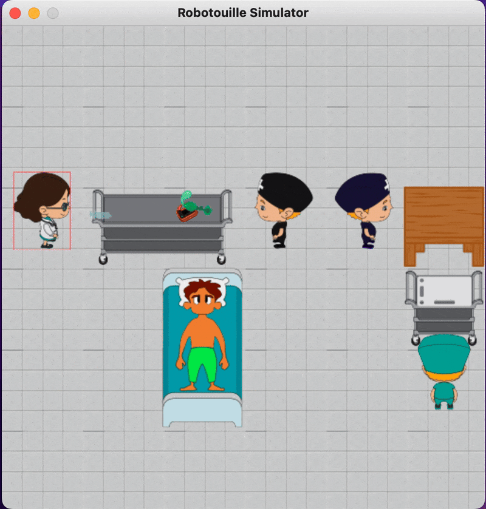

# 🏥 MARL Benchmark
<a name="readme-top"></a>

<!-- TABLE OF CONTENTS -->
<details>
  <summary>Table of Contents</summary>
  <ol>
    <li><a href="#about-the-project">About The Project</a></li>
    <li>
      <a href="#getting-started">Getting Started</a>
      <ul>
        <li><a href="#setup">Setup</a></li>
      </ul>
    </li>
    <li><a href="#repository-outline">Repository Outline</a></li>
    <li>
      <a href="#usage">Usage</a>
      <ul>
        <li><a href="#play-mode-interactive">Play Mode (Interactive)</a></li>
        <li><a href="#existing-environments">Existing Environments</a></li>
        <li><a href="#creating-your-own-environment">Creating Your Own Environment</a></li>
      </ul>
    </li>
    <li>
      <a href="#training-and-reproducing-paper-experiments">Training and Reproducing Paper Experiments</a>
      <ul>
        <li><a href="#algorithm-selection">Algorithm Selection</a></li>
        <li><a href="#fairness-configuration">Fairness Configuration</a></li>
        <li><a href="#quick-sanity-check">Quick Sanity Check</a></li>
        <li><a href="#full-training-run">Full Training Run</a></li>
        <li><a href="#reproducing-all-paper-conditions">Reproducing All Paper Conditions</a></li>
      </ul>
    </li>
    <li><a href="#built-with">Built With</a></li>
    <li><a href="#license">License</a></li>
  </ol>
</details>

<!-- ABOUT THE PROJECT -->
## About The Project

<p align="middle">
  
</p>

We introduce MARLHospital, the first diagnostic benchmark designed specifically to expose when workload-only fairness metrics fail in heterogeneous cooperative teams. Unlike existing benchmarks, MARLHospital combines skill heterogeneity, energy constraints, and sequential task dependencies to create conditions where workload balance and skill-task alignment can diverge measurably.

We define two goals in MARLHospital, Partial (P) and Complete (C), with task difficulties based on the length of the time horizon. For the CPR goal, agents must perform CPR: a short time horizon task consisting of picking up and placing a board under the patient and giving $N$ chest compressions. For the rescue breaths goal (longer horizon), agents must additionally pick up the BVM and place it on the patient to give oxygen. These goals can be modified via JSON configuration files, allowing users to programmatically specify parameters such as compression counts, breath requirements, agents' skill levels, and equipment needs without modifying simulator code.

### Foundation

MARLHospital is released under the MIT license. It implements the EPyMARL `MultiAgentEnv` interface and integrates with EPyMARL and PyMARL without modification. We build on the Robotouille PDDL infrastructure (originally developed for LLM planning in a cooking domain) and replace both the domain (with hospital resuscitation tasks) and the planning interface (with a MARL state wrapper exposing skill levels and energy dynamics). The PDDL backend is retained for symbolic action preconditions and procedural problem generation.

### Configuration System

Team compositions, skill distributions, task parameters, agent counts, and energy dynamics are specified through JSON configuration files. The PDDL builder procedurally generates agent identifiers and skill-conditioned action preconditions at initialization, so researchers can define new heterogeneity profiles without modifying simulator code.

### Observation Space and Metrics

Skills are encoded as one-hot vectors in every agent's observation. Fairness metrics ($L_1$, $L_2$, $L_3$, alignment score, workload range) are returned in the `info` dictionary at episode end.

### Task Structure and Clinical Validation

Task structures follow the American Red Cross Adult Basic Life Support protocols and were reviewed with emergency department clinicians. MARLHospital is a research benchmark for algorithm development and is not intended for clinical deployment.

<p align="right">(<a href="#readme-top">back to top</a>)</p>

<!-- GETTING STARTED -->
## Getting Started

### Setup

1. Create and activate a virtual environment:
```sh
   python3 -m venv <venv-name>
   source <venv-name>/bin/activate
```
2. Install the benchmark and its dependencies:
```sh
   pip install -e .
```
3. Run the simulator:
```sh
   python main.py
```
   Or import it from your own code:
```python
   from robotouille import simulator
   simulator("original")
```

<p align="right">(<a href="#readme-top">back to top</a>)</p>

## Repository Outline

- `robotouille/` — Core environment logic and simulator
- `environments/env_generator/examples/` — JSON definitions for initializing environments
- `environments/robotouille/` — PDDL files corresponding to the JSON definitions
- `epymarl/` — EPyMARL integration for MARL training
- `utils/` — Environment wrappers, RL inputs, reward handlers, and fairness components

<p align="right">(<a href="#readme-top">back to top</a>)</p>

## Usage

### Play Mode (Interactive)

To play an environment interactively with keyboard and mouse:

```sh
python main.py --environment_name multiagent_rescuebreaths --mode PLAY
```

#### Controls

- **Click** on a station to move the active agent there and pick up or place objects. Stacking and unstacking are also click-based.
- **`spacebar`** waits in place or switches the active agent (e.g., when a station is occupied or you need a different agent to act).
- **`e`** triggers special actions at the agent's current station: `stackunder`, `compresschest`, `giverescuebreaths`, `giveshock`, `givemedicine`. The number of `e` presses required for each action is configured via `num_compressions`, `num_breaths`, `num_shocks`, and `num_medicine_doses` in the environment JSON.

#### Walkthrough: Complete Resuscitation Sequence

The following walkthrough completes the full goal state (CPR + rescue breaths + shock + medicine):

1. **CPR board.** Pick up the CPR board from the cart, move to the patient, place the board on the patient. Press `e` **once** to trigger `stackunder` (places the board *under* the patient).
2. **Chest compressions.** Press `e` **three times** to perform `compresschest`. Visual effect: a red CPR icon appears on the patient's chest.
3. **Rescue breaths.** Pick up the pump from the cart, place it on the patient. Press `e` **twice** to perform `giverescuebreaths`. Visual effect: a blue mouth-to-mouth icon appears on the patient's chest.
4. **Shock.** Pick up the AED from the cart, place it on the patient. Press `e` **once** to perform `giveshock`. Visual effect: a shock sign appears on the patient's chest.
5. **Medicine.** Pick up the syringe from the cart, place it on the patient. Press `e` **once** to perform `givemedicine`. Visual effect: a syringe is placed on the patient's arm.

This completes the goal state.

> **Note:** Use `spacebar` for all agent movement and item pickup/placement. The `e` key is reserved for triggering the special action at the agent's current station.

### Existing Environments

Environment definitions live as JSON files in `environments/env_generator/examples/`. To run a specific environment:

```sh
python main.py --environment_name multiagent_test
```

To procedurally generate variants from a base JSON:

```sh
python main.py --environment_name multiagent_test --seed 42
python main.py --environment_name multiagent_test --seed 42 --noisy_randomization
```

See `environments/env_generator/README.md` for details on procedural generation.

To switch between tasks during training, change `--env-name` to any of the supported environments, such as:
- `multiagent_givemedicine_specforced_coop`
- `multiagent_rescuebreaths_specsimplemoreskills`
- `multiagent_rescuebreaths_specskilled_energy`

### Creating Your Own Environment

Add a JSON file under `environments/env_generator/examples/` and a corresponding PDDL file in `environments/robotouille/`. The transition logic lives in `robotouille.pddl` under `environments/`. The current implementation has limited support for non-Markovian actions (cut, cook) and for rendering new objects/actions; we plan to extend this.

<p align="right">(<a href="#readme-top">back to top</a>)</p>

## Training and Reproducing Paper Experiments

Training uses the integrated [EPyMARL](https://github.com/uoe-agents/epymarl) framework. The fairness penalty is configured via environment variables; the algorithm and environment are selected via standard EPyMARL flags.

### Algorithm Selection

Algorithm choice is controlled via the `--config` flag, which corresponds to a YAML file in `epymarl/config/algs/`. Common options:

- `qmix.yaml` — Value-decomposition for cooperative settings (used in the paper)
- `mappo.yaml` — Multi-Agent Proximal Policy Optimization
- `vdn.yaml` — Simpler value decomposition
- `coma.yaml` — Counterfactual Multi-Agent Policy Gradients

Each YAML defines hyperparameters and structural components. To extend or add algorithms, modify `epymarl/learners/` and `epymarl/controllers/` and link them via the YAML config.

### Fairness Configuration

The paper's fixed-penalty conditions are configured through environment variables read by the reward handlers in `utils/`:

| Variable | Values used in paper | Description |
|---|---|---|
| `USE_FAIRNESS` | `True` | Enable workload-based fairness reward shaping |
| `LAMBDA_FAIRNESS` | `0`, `10`, `30`, `50` | Fixed-penalty weight (`0` = no-fairness baseline) |
| `FAIRNESS_ALPHA` | `0`, `1.0` | Workload/skill trade-off (composite objective `L3 = αL1 + (1−α)L2`) |
| `INITIAL_LAMBDA` | `0` | Starting λ for adaptive schedules |
| `WARMUP_EPISODES` | `0` | Warmup before λ updates |
| `SCHEDULE_TYPE` | `constant` | λ schedule type for fixed-penalty runs |
| `OBSERVATION_MODE` | `LARGE` | Observation tensor configuration |

The FEN baseline uses a separate set of variables (see *Reproducing All Paper Conditions* below).

### Quick Sanity Check

A short single-seed run that verifies the environment loads, the fairness handler attaches, and training proceeds. Runtime is roughly 10–20 minutes on a single GPU.

```sh
USE_FAIRNESS=True LAMBDA_FAIRNESS=10 FAIRNESS_ALPHA=0 \
INITIAL_LAMBDA=0 WARMUP_EPISODES=0 SCHEDULE_TYPE=constant \
OBSERVATION_MODE=LARGE \
python epymarl/main.py \
    --config=qmix \
    --env-config=gymma \
    with env_args.time_limit=0 \
    env_args.observation_mode=LARGE \
    t_max=200000 \
    test_interval=2000 \
    test_nepisode=50 \
    seed=123 \
    --env-name=multiagent_rescuebreaths_specsimplemoreskills
```

### Full Training Run

A single full-length run matching the paper (40M timesteps, fixed-λ workload fairness):

```sh
USE_FAIRNESS=True LAMBDA_FAIRNESS=10 FAIRNESS_ALPHA=0 \
INITIAL_LAMBDA=0 WARMUP_EPISODES=0 SCHEDULE_TYPE=constant \
OBSERVATION_MODE=LARGE \
python epymarl/main.py \
    --config=qmix \
    --env-config=gymma \
    with env_args.time_limit=0 \
    env_args.observation_mode=LARGE \
    t_max=40000000 \
    test_interval=2000 \
    save_model_interval=10000000 \
    test_nepisode=200 \
    seed=123 \
    --env-name=multiagent_rescuebreaths_specsimplemoreskills \
    use_cuda=True \
    buffer_cpu_only=False \
    checkpoint_path="checkpoints/qmix_l10_a0_s123"
```

### Reproducing All Paper Conditions

The paper reports five seeds (`12345, 23456, 34567, 45678, 56789`).

**No-fairness baseline and fixed-λ conditions** use the *Full Training Run* command above, varying `LAMBDA_FAIRNESS`:

| Condition | LAMBDA_FAIRNESS | FAIRNESS_ALPHA |
|---|---|---|
| No fairness baseline | `0` | `0` |
| Fixed λ=10 | `10` | `0` |
| Fixed λ=30 | `30` | `0` |
| Fixed λ=50 | `50` | `0` |

**FEN baseline** uses a different reward mechanism, environment, and hyperparameter set:

```sh
USE_FAIRNESS=false USE_FAIR_GNE=false \
REWARD_TYPE=fen FEN_WEIGHT=1.0 FEN_C=1.0 FEN_EPSILON=1e-6 \
OBSERVATION_MODE=LARGE \
python epymarl/main.py \
    --config=qmix \
    --env-config=gymma \
    with env_args.time_limit=50 \
    env_args.observation_mode=LARGE \
    batch_size=64 \
    batch_size_run=1 \
    buffer_cpu_only=True \
    buffer_size=2500 \
    lr=0.0005 \
    optim_alpha=0.99 \
    optim_eps=0.00001 \
    grad_norm_clip=10 \
    t_max=40000000 \
    test_interval=50000 \
    save_model_interval=1000000 \
    test_nepisode=10 \
    seed=123 \
    --env-name=multiagent_rescuebreaths_specsimplefen \
    use_cuda=True \
    checkpoint_path="checkpoints/qmix_fen_s123"
```

Run each of the four fixed-λ conditions plus FEN with all five seeds: 25 runs total (4 × 5 + 5).

<p align="right">(<a href="#readme-top">back to top</a>)</p>

## Built With

- [EPyMARL](https://github.com/uoe-agents/epymarl) — Multi-agent RL framework
- [PDDLGym](https://github.com/tomsilver/pddlgym) — PDDL-based environment interface
- [Robotouille](https://github.com/portal-cornell/robotouille) — PDDL builder
- [PyGame](https://www.pygame.org/) — Rendering

<p align="right">(<a href="#readme-top">back to top</a>)</p>

## License

Released under the MIT License. See `LICENSE` for details.

<p align="right">(<a href="#readme-top">back to top</a>)</p>
